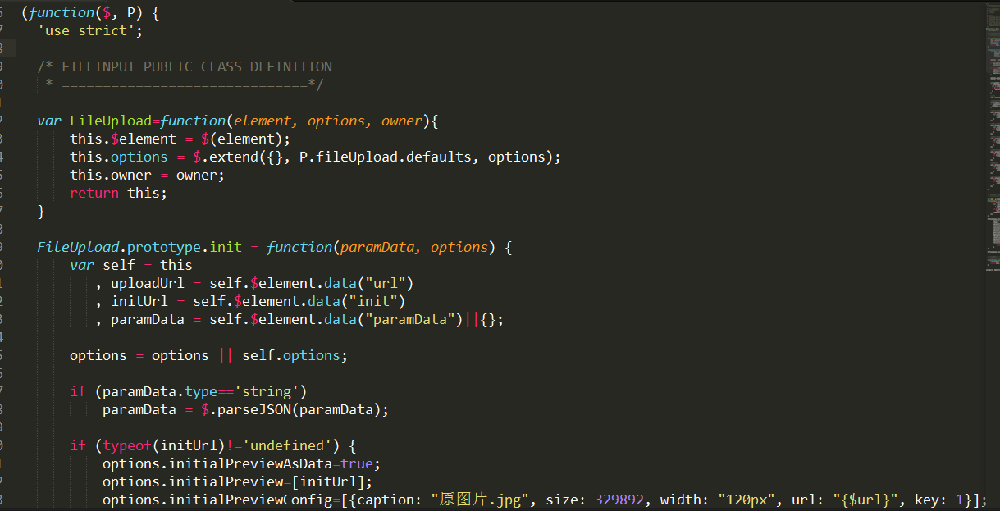
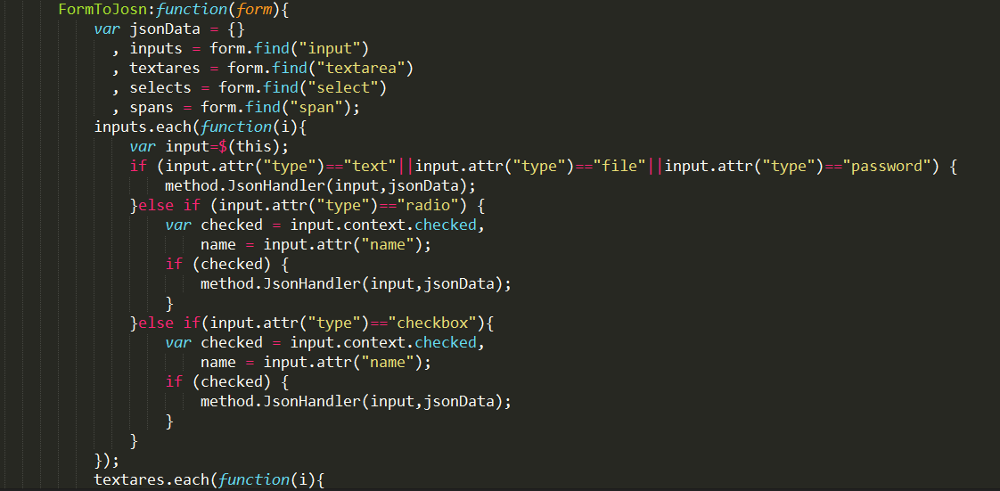

bootstrap扩展插件和工作中好用小控件整理
=============

### 1.控件推荐

##### 1.1 clipboard  该控件可以直接赋值目标dom值至剪切板，具体js位于:  
         deps/clipboard/clipboard.min.js

##### 1.2 bootstrap-select 该控件在原先select的基础上可以支持模糊查询，具体js位于
         deps/bootstrap-select

##### 1.3 bootstrap-fileinput 这款控件及其强大美观，支持拖拽多文件等上传，具体api可以参考,[链接地址](http://blog.csdn.net/u012526194/article/details/69937741)
         deps/bootstrap-fileinput

### 2.基于bootstrap-fileinput，handlerbar封装的扩展控件，inputfile


##### 2.1 使用需知:
 * 基于bootstrap-fileinput,handlerbar
 * 
 * Pre-requisites(基础js需要):
 * 1.Bootstrap 3.x
 * 2.JQuery
 * 
 * Usage(具体使用时依赖):
 * bootstrap.min.css
 * fileinput.min.css
 * Handlebars
 * bootstrap.min.js
 * fileinput.min.js
 * theme.js(bootstrap-fileinput/themes/explorer-fa)
 * (lang).js(bootstrap-fileinput/js/locales)

##### 2.2 代码片段（bootstrap风格）:



##### 2.3 使用:
```
 <input data-component="fileUpload" data-url="http://localhost:10700/file/open/upload" data-callback="developmanager-app-file" data-param-data='{"dir":"icon"}' id="file" type="file" name="file" class="form-group">
```         

##### 2.4 说明
###### 2.4.1 data-component="fileUpload" 控件声明，必须指定
###### 2.4.2 data-url="XXXX"  图片上传地址，必须指定
###### 2.4.3 data-callback="" 上传成功或失败等操作后，回调函数，看具体需求指定
###### 2.4.4 data-param-data="" 上传额外参数

##### 2.5 默认设置 options 
```
 P.fileUpload.defaults = {
          language : 'zh', 
          theme : 'fa',
          uploadUrl : null,
          allowedFileExtensions : [ 'jpg', 'png', 'gif', 'bmp','jpeg' ],
          overwriteInitial : false,
          initialPreviewAsData: false,
          initialPreview: [],
          maxFilesNum : 1,
          maxFileSize : 102400,          
          uploadAsync : false,
          showPreview : false,            
          uploadExtraData :null, 
          initialPreviewShowDelete : false,
          initialPreviewConfig: [],
          slugCallback : function (filename) {
              return filename.replace('(', '_').replace(']', '_');
          }
  };
```

### 3.工作中积累下来的一些utils,具体位于:
        /core/method/method.js
##### 3.1 其中method中的formToJson方法，个人认为写的还算可以。
###### 3.2 formToJson代码片段:





    


         
